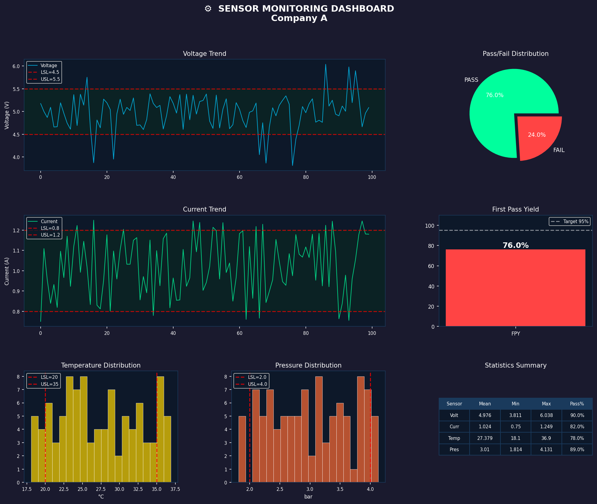

# Sensor Dashboard 📊

A Python data analytics dashboard that reads 
sensor CSV data and generates professional 
matplotlib charts for engineering analysis.

## Features
- 📈 Voltage & Current trend lines with spec limits
- 🥧 Pass/Fail distribution pie chart
- 📊 FPY (First Pass Yield) bar chart
- 📉 Temperature & Pressure histograms
- 📋 Statistics summary table
- 🌙 Professional dark theme dashboard
- 💾 Exports to PNG image

## Tech Stack
- Python 3.12+
- Pandas — data loading & analysis
- Matplotlib — chart generation
- NumPy — numerical calculations
- OOP — 4 separate modules

## Project Structure
sensor_dashboard/
├── main.py              ← entry point
├── data_loader.py       ← CSV loading
├── analyser.py          ← statistics
├── chart_generator.py   ← matplotlib charts
└── sample_data/
└── generate_data.py ← sample data generator

## How To Run
```bash
# Install dependencies
pip install matplotlib pandas numpy

# Generate sample data
cd sample_data
python generate_data.py
cd ..

# Run dashboard
python main.py

# Open output/dashboard.png
```

## Sample Dashboard


## Spec Limits
| Sensor | LSL | USL | Unit |
|--------|-----|-----|------|
| Voltage | 4.5 | 5.5 | V |
| Current | 0.8 | 1.2 | A |
| Temperature | 20.0 | 35.0 | °C |
| Pressure | 2.0 | 4.0 | bar |

## Author
Muhammad Hafizul Bin Ahmad Husni
Mechatronics Engineering — USM

# Copy dashboard.png to root folder
copy output\dashboard.png dashboard.png

# Keep root dashboard image for README
!dashboard.png